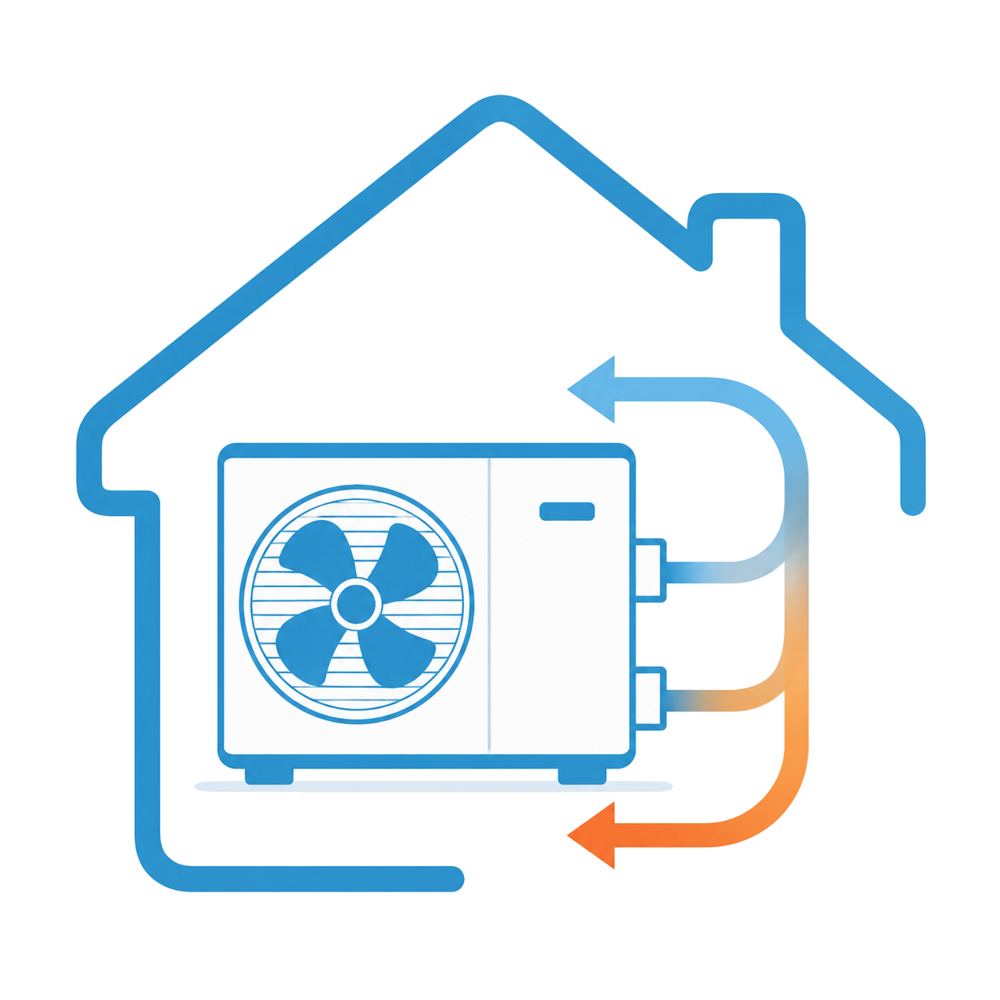

# ioBroker.luxtronik2-controller

**Tests:** 

## luxtronik2-controller adapter for ioBroker

This ioBroker adapter enables the local control and monitoring of heat pumps with Luxtronik 2.x controllers (e.g., Alpha Innotec, Novelan). The adapter is written entirely in TypeScript.

## Acknowledgements & History

This project builds upon the preliminary work of existing open-source projects. Special thanks go to:

[Bouni](https://github.com/bouni/luxtronik-2) Whose pioneering work and code developments form the essential foundation for communication with Luxtronik controllers.

[Coolchip:](https://github.com/coolchip/luxtronik2) For the fundamental reverse engineering of the Luxtronik network protocol.

[UncleSamSwiss:](https://github.com/UncleSamSwiss/ioBroker.luxtronik2) For the original ioBroker adapter.

Innovations in this version: The luxtronik2-controller natively integrates TCP communication (Port 8888 / 8889) and does not rely on external libraries. Additionally, controlling macros, a logic for compressor protection, and automated datapoint management were implemented.

## Features

- Native TCP communication: Direct connection to the heat pump without additional overhead.

- Compressor protection (Cycle optimization): Combining heating and domestic hot water cycles to reduce compressor starts.

- Integrated actions (Macros): Predefined control logics for forced heating, hot water requests, and the circulation pump (ZIP) incl. automatic fallback to default values.

- Custom datapoints: Measured values (Index 3004) and parameters (Index 3003) can be added via the adapter configuration. Unix timestamps are formatted automatically.

- Automatic object management: Deselected or deleted datapoints and empty folder structures are automatically removed from ioBroker upon an adapter restart.

- Notification system: Heat pump error codes can be sent directly to Telegram or the ioBroker notification system.

- Motion detector coupling: Option for demand-driven activation of the circulation pump via existing ioBroker motion sensors.

## ⚠️ Warning

Some settings provided by this integration can affect the performance of your heat pump. Misconfigurations can cause the controller to enter a fault state, which requires a manual on-site reset.

This project aims to protect your heat pump by restricting the configuration options to safe values. However, no guarantees can be made. Please be careful, consult your Luxtronik manual, and do not change any settings that you do not fully understand.

## 🔧 Compatibility

The integration allows you to monitor and control heat pumps with a Luxtronik2 controller. It works locally without internet access.
It was and is being tested with an LWD50A (LD5) from Alpha Innotec.

## ⚠️ Disclaimer / Haftungsausschluss ⚠️

Dieses Projekt steht in keinerlei Verbindung zu Alpha Innotec, Novelan, ait-deutschland GmbH oder anderen Herstellern. Es handelt sich um ein privates Open-Source-Projekt, das in der Freizeit entwickelt und gepflegt wird. Die Nutzung des Adapters geschieht auf eigene Gefahr.

_This project is not affiliated with Alpha Innotec, Novelan, ait-deutschland GmbH, or any other company. It is a personal project that is maintained in spare time. Use at your own risk._

## Reporting Bugs & Contributing

Bug reports, compatibility notes for specific firmware versions, or feature requests can be submitted via the issue tracker in the [GitHub-Repository](https://github.com/TbsJah/ioBroker.luxtronik2-controller/issues).

## Information

[Info Deutsch](documentation/readme_de.md)

[Info English](documentation/readme_en.md)

## Changelog

// ### **WORK IN PROGRESS**

### **WORK IN PROGRESS**

- Websocket port added for firmware >3.8
- NPM package ws added

### 0.2.0 (2026-07-09)

- Readme - German

## License

MIT License

Copyright (c) 2026 TbsJah <github.tbsjah@googlemail.com>

Permission is hereby granted, free of charge, to any person obtaining a copy
of this software and associated documentation files (the "Software"), to deal
in the Software without restriction, including without limitation the rights
to use, copy, modify, merge, publish, distribute, sublicense, and/or sell
copies of the Software, and to permit persons to whom the Software is
furnished to do so, subject to the following conditions:

The above copyright notice and this permission notice shall be included in all
copies or substantial portions of the Software.

THE SOFTWARE IS PROVIDED "AS IS", WITHOUT WARRANTY OF ANY KIND, EXPRESS OR
IMPLIED, INCLUDING BUT NOT LIMITED TO THE WARRANTIES OF MERCHANTABILITY,
FITNESS FOR A PARTICULAR PURPOSE AND NONINFRINGEMENT. IN NO EVENT SHALL THE
AUTHORS OR COPYRIGHT HOLDERS BE LIABLE FOR ANY CLAIM, DAMAGES OR OTHER
LIABILITY, WHETHER IN AN ACTION OF CONTRACT, TORT OR OTHERWISE, ARISING FROM,
OUT OF OR IN CONNECTION WITH THE SOFTWARE OR THE USE OR OTHER DEALINGS IN THE
SOFTWARE.

[Older changelogs can be found there](CHANGELOG_OLD.md)
